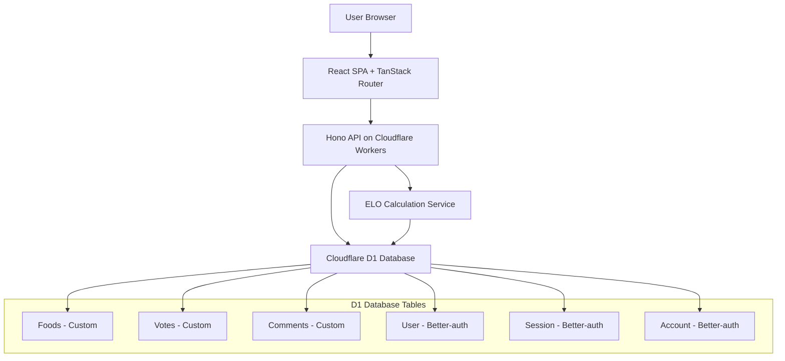

# Design Document

## Overview

The Korean Food ELO Ranking System is a web application that allows users to compare Korean foods in head-to-head matchups, updating ELO ratings based on user preferences. The system provides anonymous participation with optional nationality tracking, comment functionality, and real-time leaderboards.

## Architecture

### Technology Stack

- **Frontend**: React SPA with TypeScript, TanStack Router for routing, and TanStack Query for server state management
- **Backend**: Hono framework running on Cloudflare Workers
- **Database**: Cloudflare D1 (SQLite) with Drizzle ORM for type-safe queries
- **Authentication**: Better-auth with anonymous plugin for session management
- **Deployment**: Cloudflare Workers with static assets serving for unified deployment

### System Architecture



## Components and Interfaces

### Frontend Components

#### 1. Food Comparison Component

- Displays two food items with photos and names
- Primary selection buttons for each food
- Expandable "More options" section with tie/skip options
- Handles user selection and navigation to results

#### 2. Results Component

- Shows vote percentages for the current pairing
- Displays nationality breakdown if available
- Comment input field with nationality selector
- Recent comments display for this specific pairing
- "Continue" button for next comparison
- **Access Control**: Only accessible after user makes a selection for that specific pairing
- **Immediate Display**: Automatically shown immediately after user completes any selection

#### 3. Leaderboard Component

- Sortable list of foods by ELO score using TanStack Query
- Food photos, names, scores, and rankings
- Real-time score updates with automatic refetching
- Optimistic updates for immediate UI feedback

#### 4. Navigation Component

- Links between comparison, leaderboard, and other sections
- Session state management

#### 5. Nationality Prompt Component

- **First-Time User Flow**: Appears when user makes their first selection or comment
- Optional nationality selector with common countries
- "Skip" option to proceed without providing nationality
- Stores nationality preference in user session for future interactions
- **Design Rationale**: Prompting after first interaction prevents bias in initial food selection

### TanStack Query Integration

#### Query Management

```typescript
// Custom hooks for data fetching
const useFoodPair = () =>
  useQuery({
    queryKey: ["foods", "random-pair"],
    queryFn: () => api.foods.getRandomPair(),
    staleTime: 0, // Always fetch fresh pair
  });

const useLeaderboard = () =>
  useQuery({
    queryKey: ["foods", "leaderboard"],
    queryFn: () => api.foods.getLeaderboard(),
    staleTime: 30000, // Cache for 30 seconds
    refetchInterval: 60000, // Auto-refetch every minute
  });

const useVoteStats = (food1Id: string, food2Id: string) =>
  useQuery({
    queryKey: ["votes", "stats", food1Id, food2Id],
    queryFn: () => api.votes.getStats(food1Id, food2Id),
    enabled: !!food1Id && !!food2Id,
  });
```

#### Mutation Management

```typescript
// Optimistic updates for voting
const useVoteMutation = () =>
  useMutation({
    mutationFn: api.votes.create,
    onMutate: async (newVote) => {
      // Optimistically update leaderboard
      await queryClient.cancelQueries(["foods", "leaderboard"]);
      const previousData = queryClient.getQueryData(["foods", "leaderboard"]);

      queryClient.setQueryData(["foods", "leaderboard"], (old) => {
        // Optimistic ELO calculation
        return updateLeaderboardOptimistically(old, newVote);
      });

      return { previousData };
    },
    onError: (err, newVote, context) => {
      // Rollback on error
      queryClient.setQueryData(["foods", "leaderboard"], context.previousData);
    },
    onSettled: () => {
      // Refetch to ensure consistency
      queryClient.invalidateQueries(["foods", "leaderboard"]);
      queryClient.invalidateQueries(["votes", "stats"]);
    },
  });
```

### Backend API Endpoints

#### Food Management

```typescript
GET / api / foods / random - pair;
// Returns two random foods for comparison
// Response: { food1: Food, food2: Food }

GET / api / foods / leaderboard;
// Returns all foods sorted by ELO score
// Response: Food[]
```

#### Voting System

```typescript
POST /api/votes
// Records a vote and updates ELO scores
// Body: { food1Id, food2Id, selection: 'food1' | 'food2' | 'tie' | 'skip', sessionId?, nationality? }
// Response: { updatedScores: { food1: number, food2: number }, voteStats: VoteStats, hasVoted: boolean }
// Note: Prevents duplicate voting on same pairing by same user

GET /api/votes/stats/:food1Id/:food2Id
// Returns voting statistics for a specific pairing (requires user to have voted on this pairing)
// Headers: Authorization with session token
// Response: { totalVotes, food1Percentage, food2Percentage, nationalityBreakdown, userHasVoted: boolean }
// Note: Returns 403 if user hasn't voted on this pairing (Requirement 4.6)
```

#### Comments System

```typescript
POST /api/comments
// Creates a new comment
// Body: { food1Id, food2Id, selectedFood, content, nationality?, sessionId }
// Response: Comment

GET /api/comments/:food1Id/:food2Id
// Returns recent comments for a food pairing (requires user to have voted on this pairing)
// Headers: Authorization with session token
// Response: Comment[] with selectedFood, content, nationality, and timestamp
// Note: Returns 403 if user hasn't voted on this pairing (Requirement 4.6)
```

#### Authentication & Session Management (Better-auth)

```typescript
// Better-auth endpoints (auto-generated)
POST /api/auth/sign-in/anonymous
// Creates anonymous session
// Response: { user, session }

GET /api/auth/session
// Gets current session
// Response: { user, session }

POST /api/auth/session/update
// Updates user nationality (prompted after first vote/comment)
// Body: { nationality? }
// Response: { user, session }
// Note: Nationality is optional and can be skipped entirely
```

## Data Models

### Better-auth Configuration & Drizzle Schema

```typescript
// auth.ts - Better-auth configuration
import { betterAuth } from "better-auth";
import { drizzleAdapter } from "better-auth/adapters/drizzle";
import { anonymous } from "better-auth/plugins";
import { db } from "./db";

export const auth = betterAuth({
  database: drizzleAdapter(db, {
    provider: "sqlite",
  }),
  user: {
    additionalFields: {
      nationality: {
        type: "string",
        required: false,
        input: true, // Allow users to set nationality
      },
    },
  },
  plugins: [
    anonymous({
      emailDomainName: "korean-food-elo.com",
      generateName: () =>
        `Anonymous User ${Math.random().toString(36).substr(2, 9)}`,
    }),
  ],
});

// schema.ts - Custom tables (Better-auth tables are auto-generated)
import { sqliteTable, text, integer } from "drizzle-orm/sqlite-core";
import { sql } from "drizzle-orm";

export const foods = sqliteTable("foods", {
  id: text("id").primaryKey(),
  name: text("name").notNull(),
  imageUrl: text("image_url").notNull(),
  eloScore: integer("elo_score").default(1200).notNull(),
  totalVotes: integer("total_votes").default(0).notNull(),
  createdAt: text("created_at").default(sql`CURRENT_TIMESTAMP`),
  updatedAt: text("updated_at").default(sql`CURRENT_TIMESTAMP`),
});

export const votes = sqliteTable("votes", {
  id: text("id").primaryKey(),
  food1Id: text("food1_id").references(() => foods.id),
  food2Id: text("food2_id").references(() => foods.id),
  selectedFood: text("selected_food", {
    enum: ["food1", "food2", "tie", "skip"],
  }).notNull(),
  userId: text("user_id"), // References better-auth user table
  createdAt: text("created_at").default(sql`CURRENT_TIMESTAMP`),
});

export const comments = sqliteTable("comments", {
  id: text("id").primaryKey(),
  food1Id: text("food1_id").references(() => foods.id),
  food2Id: text("food2_id").references(() => foods.id),
  selectedFood: text("selected_food", {
    enum: ["food1", "food2", "tie"],
  }).notNull(),
  content: text("content").notNull(),
  userId: text("user_id"), // References better-auth user table
  createdAt: text("created_at").default(sql`CURRENT_TIMESTAMP`),
});

// Type inference
export type Food = typeof foods.$inferSelect;
export type Vote = typeof votes.$inferSelect;
export type Comment = typeof comments.$inferSelect;
// User type is inferred from better-auth with nationality field
```

## Database Schema

### Tables

```sql
-- D1 Database Schema (SQLite)
-- Note: Better-auth tables (user, session, account, verification) are auto-generated

-- Custom Foods table
CREATE TABLE foods (
  id TEXT PRIMARY KEY,
  name TEXT NOT NULL,
  image_url TEXT NOT NULL,
  elo_score INTEGER DEFAULT 1200,
  total_votes INTEGER DEFAULT 0,
  created_at DATETIME DEFAULT CURRENT_TIMESTAMP,
  updated_at DATETIME DEFAULT CURRENT_TIMESTAMP
);

-- Custom Votes table
CREATE TABLE votes (
  id TEXT PRIMARY KEY,
  food1_id TEXT REFERENCES foods(id),
  food2_id TEXT REFERENCES foods(id),
  selected_food TEXT CHECK (selected_food IN ('food1', 'food2', 'tie', 'skip')),
  user_id TEXT REFERENCES user(id), -- Better-auth user table
  created_at DATETIME DEFAULT CURRENT_TIMESTAMP
);

-- Custom Comments table
CREATE TABLE comments (
  id TEXT PRIMARY KEY,
  food1_id TEXT REFERENCES foods(id),
  food2_id TEXT REFERENCES foods(id),
  selected_food TEXT CHECK (selected_food IN ('food1', 'food2', 'tie')),
  content TEXT NOT NULL,
  user_id TEXT REFERENCES user(id), -- Better-auth user table
  created_at DATETIME DEFAULT CURRENT_TIMESTAMP
);

-- Indexes for performance
CREATE INDEX idx_votes_foods ON votes(food1_id, food2_id);
CREATE INDEX idx_comments_foods ON comments(food1_id, food2_id);
CREATE INDEX idx_foods_elo ON foods(elo_score DESC);
CREATE INDEX idx_votes_created_at ON votes(created_at DESC);
CREATE INDEX idx_comments_created_at ON comments(created_at DESC);
CREATE INDEX idx_votes_user ON votes(user_id);
CREATE INDEX idx_comments_user ON comments(user_id);
-- Composite index for checking if user has voted on specific pairing (Requirement 4.6)
CREATE UNIQUE INDEX idx_votes_user_pairing ON votes(user_id, food1_id, food2_id);
```

## ELO Calculation System

### Algorithm Implementation

```typescript
class ELOCalculator {
  private static readonly K_FACTOR = 32; // Standard K-factor for ELO

  static calculateNewRatings(
    rating1: number,
    rating2: number,
    result: "win" | "loss" | "tie"
  ): { newRating1: number; newRating2: number } {
    const expected1 = 1 / (1 + Math.pow(10, (rating2 - rating1) / 400));
    const expected2 = 1 - expected1;

    let actual1: number, actual2: number;

    switch (result) {
      case "win":
        actual1 = 1;
        actual2 = 0;
        break;
      case "loss":
        actual1 = 0;
        actual2 = 1;
        break;
      case "tie":
        actual1 = 0.5;
        actual2 = 0.5;
        break;
    }

    const newRating1 = Math.round(
      rating1 + this.K_FACTOR * (actual1 - expected1)
    );
    const newRating2 = Math.round(
      rating2 + this.K_FACTOR * (actual2 - expected2)
    );

    return { newRating1, newRating2 };
  }
}
```

### Vote Processing Flow

1. Receive vote from frontend with session validation
2. Validate vote data and ensure user hasn't voted on this pairing before
3. Calculate new ELO scores (skip votes don't affect ELO, ties count as 0.5 points each)
4. Update food records in database transaction with optimistic locking
5. Store vote record with user session and optional nationality
6. Return updated scores, vote statistics, and nationality breakdown
7. **Immediate Results**: Frontend automatically navigates to results screen
8. **Access Control**: Results are only shown for pairings where user has voted

## Error Handling

### Frontend Error Handling

- Network connectivity issues with retry mechanism
- Invalid responses with user-friendly messages
- Loading states for all async operations
- Graceful degradation when features are unavailable

### Backend Error Handling

- Database connection failures with circuit breaker pattern
- Invalid request data with detailed validation messages
- Rate limiting to prevent abuse
- Comprehensive logging for debugging

### Error Response Format

```typescript
interface ErrorResponse {
  error: string;
  message: string;
  code: number;
  details?: any;
}
```

## Testing Strategy

### Unit Testing

- ELO calculation logic with various scenarios
- Database model validation
- API endpoint input/output validation
- React component rendering and interactions

### Integration Testing

- Full vote flow from frontend to database
- Comment creation and retrieval
- Session management across requests
- Database transaction integrity

### End-to-End Testing

- Complete user journey from food comparison to results
- Cross-browser compatibility
- Mobile responsiveness
- Performance under load

### Test Data

- Seed database with representative Korean foods
- Mock nationality data for testing analytics
- Automated test data cleanup

## Performance Considerations

### Database Optimization

- Proper indexing on frequently queried columns
- Connection pooling for concurrent requests
- Query optimization for leaderboard and statistics

### Caching Strategy

- Redis cache for frequently accessed leaderboard data
- Browser caching for food images
- API response caching for static data

### Scalability

- Horizontal scaling capability for API servers
- Database read replicas for heavy read operations
- CDN for static assets and images

## Access Control Design

### Results and Comments Access Control

**Design Rationale**: To prevent bias in voting decisions, users can only view results and comments for food pairings after they have made their own selection (Requirement 4.6).

**Implementation**:

- Vote records include composite unique constraint on (user_id, food1_id, food2_id)
- Results and comments endpoints verify user has voted before returning data
- Frontend enforces this by only navigating to results after successful vote submission
- Database queries join votes table to verify user participation before showing results

**Benefits**:

- Prevents users from being influenced by others' choices before making their own
- Ensures authentic personal preferences are captured
- Creates fair comparison environment where all users vote independently

## Security Considerations

### Data Privacy

- No personally identifiable information storage
- Optional nationality data with user consent
- Session-based tracking without persistent user accounts

### Input Validation

- Sanitize all user inputs to prevent XSS
- Validate vote selections and comment content
- Rate limiting on API endpoints
- Prevent duplicate voting on same pairing by same user

### Database Security

- Parameterized queries to prevent SQL injection
- Proper access controls and user permissions
- Regular security updates and patches
- Composite unique indexes to prevent data integrity issues
